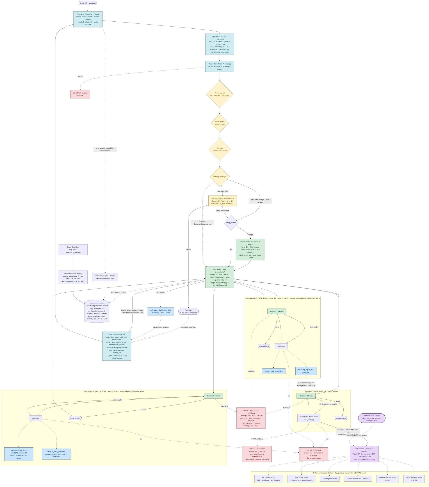

# Vancouver Sommelier AI

> 2026 Google for Startups AI Agents Challenge — Track 1: Build

A multi-agent AI drinks concierge for the Vancouver market. Built on a LangGraph Supervisor + 3 specialist agent architecture, it searches real-time inventory and pricing across 6 Vancouver-area retail chains (including BC Liquor Stores' 200+ locations province-wide and Everything Wine's 4 Lower Mainland stores), provides expert knowledge via Google Search grounding, and offers food pairing guidance. Supports both B2C (consumer recommendations) and B2B (beverage menu design for F&B businesses).
Status: **Production.** Cloudflare Pages (frontend) + Google Cloud Run (backend API). Multi-agent Supervisor + 3 specialists (Sourcing / Sommelier / Menu Architect), retailer tools served over **MCP (Model Context Protocol)** with a public endpoint at `wineaiagent.com/mcp`, FastAPI real-time SSE token streaming, multimodal vision node (wine label / wine list / food menu photo scanning), human-in-the-loop clarification, pre-agent query validation gate, request timeout + error recovery, LLM-as-judge quality eval pipeline.

---

## Architecture



```
User query (+ optional wine label / wine list / food menu photo)
    ↓
Cloudflare Pages (frontend/ — vanilla JS SSE client, 360s timeout)
    ↓  POST /api/chat { message, thread_id, images }
Google Cloud Run — FastAPI backend (app.py — SSE streaming)
    ↓
Proxy Secret check (Cloudflare) → Rate Limiter (slowapi)
    ↓
Pending interrupt? ──(yes — resume reply)──→ Command(resume=...) ─┐
    │(no — new turn)                                              │
    ↓                                                             │
Validation Gate (validation.py — Gemini Flash)   ※ bypassed when image attached
    │                                                             │
    ├─ INVALID → reject in user's language → SSE done → end       │
    │                                                             │
    └─ VALID ↓                                                    ↓
LangGraph Supervisor (agent.py — Gemini 3.5 Flash, max 7 tool rounds)
    │
    │   entry_router ─(image)──→ vision_node ─┐
    │                └─(text)────────────────┴→ supervisor
    │                                                ↕ InMemorySaver (thread_id)
    │   supervisor → specialist routing (+ owns clarification)
    │       ↓ (ask_user_clarification_tool)
    │    interrupt() → SSE clarification_request → user reply
    │       ↓ Command(resume=...) → next supervisor round
    │
    │   ┌──────────────────────────────────────────────────────────────────┐
    │   │  Specialist Agents (independent ReAct sub-graphs)                │
    │   │                                                                  │
    │   │  Sourcing Agent ──── 6 retailers in parallel (max 4 rounds)      │
    │   │    └─ MCP client → MCP Server "vancouver-retailers" (/mcp)       │
    │   │         └─ bcliquor, everythingwine, okanagan_cellars,          │
    │   │            suttonplace, marquis, legacy                         │
    │   │       (public Streamable HTTP endpoint: wineaiagent.com/mcp)     │
    │   │                                                                  │
    │   │  Sommelier Agent ── pairing + grounding (max 4 rounds)           │
    │   │    └─ reasoning_pair_wine, search_web_grounded                  │
    │   │                                                                  │
    │   │  Menu Architect ─── B2B beverage menu design (max 5 rounds)      │
    │   │    └─ sourcing_agent (delegation), search_web_grounded          │
    │   └──────────────────────────────────────────────────────────────────┘
    │
    │   tool_error_to_json — exceptions → status:error (non-fatal)
    │   supervisor final answer → END
    ↓
Real-time SSE token streaming → frontend (tool badges + markdown + PDF export)
    ↓
LangSmith tracing (optional)
```

A full Mermaid diagram with color-coded nodes (agents, tools, gates, stores) is available:

```bash
python draw_graph.py          # outputs graph_mermaid.md + graph.png
```

---

## Agent Architecture

Supervisor + 3 specialist pattern. Each specialist runs as an independent ReAct sub-graph, exposed to the Supervisor as a single `@tool`.

| Agent | Role | Tools | Model |
|-------|------|-------|-------|
| **Supervisor** | Query routing, specialist coordination, final answer synthesis, owns clarification | ask_user_clarification + 3 specialist tools | Gemini 3.5 Flash |
| **Sourcing Agent** | Inventory, pricing, where-to-buy — parallel calls to all 6 retail chains every time | 6 retailer tools (via MCP) | Gemini 3.5 Flash |
| **Sommelier Agent** | Pairing recs, drinks knowledge, reviews/scores (Google grounding, with citations) | reasoning_pair_wine, search_web_grounded | Gemini 3.1 Pro Preview |
| **Menu Architect** | (B2B) Design beverage menu from food menu → source real products/prices (direct delegation to Sourcing) | sourcing_agent, search_web_grounded | Gemini 3.1 Pro Preview |

**Specialist-to-specialist delegation**: The Menu Architect calls `sourcing_agent_tool` directly to source real Vancouver retail products and prices after designing the menu — an in-process hand-off between specialists, without Supervisor mediation. (This is internal LangGraph delegation, not the A2A wire protocol.)

**Multi-turn enforcement**: The Supervisor prompt enforces specialist routing on every turn — when a follow-up asks for a new product category or new recommendations ("also recommend beer", "what about spirits"), it must route to the relevant specialist rather than answering from training knowledge. The "Never invent" rule applies equally on every turn.

---

## MCP — Model Context Protocol

The six retailer search tools are not bound to the agent in-process — they are served by a dedicated **MCP server** and consumed over the protocol.

**Server — `vancouver-retailers`** ([`mcp_server.py`](mcp_server.py)). A FastMCP server (Streamable HTTP, stateless, JSON responses) exposing the 6 retailer tools with the exact same names, schemas, and JSON result envelopes as the legacy in-process wrappers. Mounted by `app.py` at `/mcp`, so one Cloud Run container serves both the chat API and the MCP endpoint.

**Client — the Sourcing Agent itself** ([`mcp_client.py`](mcp_client.py)). At first use, the Sourcing Agent loads its toolset from the MCP server via `langchain-mcp-adapters` (`MultiServerMCPClient`, `streamable_http` transport) — a self-connection to the mounted endpoint. Each tool invocation opens its own short-lived MCP session, so the agent's **all-6-retailers-in-parallel fan-out stays fully parallel** over the protocol. If the endpoint is unreachable (e.g. running the eval harness without the server), the loader logs an ERROR and falls back to the in-process tools — same tools, different transport.

**Public endpoint — `https://wineaiagent.com/mcp`.** The Cloudflare worker proxies `/mcp` to Cloud Run (injecting the proxy secret), so any external MCP client — MCP Inspector, Claude Desktop, ADK agents — can discover and call the same retailer tools the agent uses:

```bash
npx @modelcontextprotocol/inspector
# Transport: "Streamable HTTP" → URL: https://wineaiagent.com/mcp
# → tools/list shows the 6 retailer tools → call any of them live
```

Security model: direct Cloud Run access to `/mcp` (like `/api/*`) is rejected without the `X-Proxy-Secret` header that only the Cloudflare worker injects. The tools are read-only searches over each retailer's public product-discovery endpoints.

| Env var | Default | Meaning |
|---------|---------|---------|
| `SOURCING_VIA_MCP` | `1` | `0` forces the legacy in-process tools (kill switch) |
| `MCP_SELF_URL` | `http://127.0.0.1:${PORT:-8080}/mcp/` | Where the Sourcing Agent's MCP client connects |

Standalone server (without the FastAPI app): `python mcp_server.py` → `http://127.0.0.1:3001/`. Smoke test: `python scripts/mcp_smoke.py` (asserts the 6 tools load over MCP and a live call returns the expected envelope).

---

## Deployment

Frontend and backend are deployed separately.

| Layer | Service | URL |
|-------|---------|-----|
| **Frontend** | Cloudflare Pages | `wineaiagent.com` / `www.wineaiagent.com` |
| **Backend API** | Google Cloud Run | `bc-wine-agent-135257828500.us-west1.run.app` |

- Frontend (`frontend/`) is deployed directly to Cloudflare Pages. No build command, output directory `frontend/`.
- Backend is built as a Docker image and deployed to Cloud Run. Gemini API is called via GCP service account authentication.
- Frontend JS (`frontend/app.js`) calls the Cloud Run URL directly via `API_BASE`, and `app.py`'s `CORSMiddleware` allows `wineaiagent.com` / `www.wineaiagent.com` origins.
- For local development, `API_BASE` is empty, so requests go to the same server's `/api/*` endpoints.

### Cloud Run Deployment

```bash
gcloud run deploy bc-wine-agent --source . --region us-west1 --project wine-agent-jh-2026 --allow-unauthenticated
```

Required IAM roles for the Cloud Run service account:
- `roles/aiplatform.user` — Gemini API calls
- `roles/run.invoker` (allUsers) — public access

### Cloudflare Pages Deployment

Cloudflare Pages project settings:
- **Production branch**: `main`
- **Build command**: (none)
- **Build output directory**: `frontend`
- **Custom domains**: `wineaiagent.com`, `www.wineaiagent.com`

---

## Core Features

### Query Validation Gate

Before the graph is invoked, `/api/chat` runs a single Gemini Flash classification call to determine whether the query falls within the agent's scope (drinks / pairing / greetings). Off-topic queries (weather, sports, coding, etc.) bypass the graph entirely and return a short rejection message via SSE tokens **in the user's language**. If the validation LLM fails, it fails open and enters the normal agent path. Measured off-topic response time: ~2.6s (previously ~10s+).

**When the gate is bypassed.** It runs only on new text turns (`not is_resume and not req.images`). Two cases skip it by design:
- **Image turns** — the validator only reads text, so an image with little or no caption would false-trip it. Scope is enforced downstream instead: `vision_node` tags non-drink photos as `document_type="other"` and the Supervisor (Guideline G7) declines them politely.
- **Clarification replies (resume)** — a short in-context answer like "$50" or "the cheaper one" could be misread as off-topic, so the gate is skipped when resuming a pending interrupt.

Implementation: [`validation.py`](validation.py), `VALIDATION_SYSTEM_PROMPT` in [`prompts.py`](prompts.py), gate in [`app.py`](app.py).

### Human-in-the-Loop Clarification

The Supervisor can **explicitly** ask the user follow-up questions using LangGraph's `interrupt()` primitive.

Flow: Supervisor calls `ask_user_clarification_tool(question, options?)` → `interrupt({...})` fires inside the tool → graph pauses at the thread's checkpoint → `app.py` sends an SSE `clarification_request` event with question + options → frontend renders option chips + hint UI → user clicks an option or types free text → next `/api/chat` call detects pending interrupt via `aget_state(config)` → `Command(resume=req.message)` resumes the graph → tool receives the user's reply as a string and returns normally → next supervisor round proceeds.

Rules (`prompts.py` Guideline G6 — "when in doubt, ASK"):
- **Ask**: ambiguous requests (2+ interpretations), missing essential info (pairing with no dish, budget with no range), specialist results inconclusive (0 results, too many matches across categories), conflicting data between specialists, too many strong options that user preference would meaningfully filter.
- **Don't ask**: when a reasonable default exists, or you are stalling instead of making a judgment call.
- **Options**: 2-7 clickable options when natural; user can always type free text instead.
- **Limit**: max 3 per turn (`MAX_CLARIFICATIONS_PER_TURN`). At cap, forced to give best-effort answer.
- **Round counting**: clarification-only rounds are excluded from `MAX_TOOL_ROUNDS` count.
- **Validation skip on resume**: resume branch skips the validation gate so short clarification replies don't trip the off-topic filter.

Implementation: `ask_user_clarification_tool` in [`agent_tools.py`](agent_tools.py), `_count_clarifications_this_turn` in [`agent.py`](agent.py), interrupt detection + `Command(resume=...)` in [`app.py`](app.py), `renderClarification()` in [`frontend/app.js`](frontend/app.js).

### Vision — Multimodal Label / Wine List / Food Menu Scanning

When the user attaches a **wine label**, **restaurant wine list**, or **food menu photo**, a dedicated `vision_node` runs before the Supervisor to extract structured text from the image, then passes it into the normal search/recommendation flow.

Flow: frontend downscales the photo to longest edge ≤2048px JPEG and sends as base64 → `app.py` constructs a multimodal `HumanMessage` (validation gate bypassed when image attached) → `entry_router` branches on image presence → `vision_node` uses `with_structured_output(VisionExtraction)` to extract **only visible text** → replaces the `HumanMessage` in place (same id) to drop the image and fold to text (token savings) → supervisor operates text-only.

- **Wine label**: extracts producer/cuvee/varietal/vintage/region for a single wine → store tools look up price/stock.
- **Wine list**: extracts verbatim `raw_text` per line + parsed fields for N wines → queries/compares all wines on the list.
- **Food menu**: extracts menu text → Menu Architect agent designs a beverage menu.
- **Lossless**: text that doesn't fit named fields is preserved in catch-all fields (`other_text`/`raw_text`). Non-wine images get `document_type="other"` with a polite decline.
- **UI**: attach button + drag-and-drop + clipboard paste, thumbnail preview (max 2 images), `vision_start`/`vision_result` SSE events show "Image analysis" badge.

Implementation: [`vision.py`](vision.py), `VISION_EXTRACTION_PROMPT` in [`prompts.py`](prompts.py), `vision_node` + `entry_router` in [`agent.py`](agent.py), multimodal input + vision SSE in [`app.py`](app.py), image attachment UI in [`frontend/`](frontend/).

### Tool Robustness — Error Isolation + Query Fallback

**Tool error isolation.** `ToolNode(TOOLS, handle_tool_errors=tool_error_to_json)` catches **all exceptions as `status:"error"` JSON results** — a failing tool is marked as errored while the remaining tools' results are used to answer. Clarification `interrupt` (GraphInterrupt) is re-raised before the handler, so it's unaffected.

**Query fallback.** Some store backends (Okanagan Cellars, Everything Wine, Legacy) **AND-match all query tokens** against product names. The shared helper [`tools/query_fallback.py`](tools/query_fallback.py) retries on zero results by **stripping varietal/vintage, then progressively trimming trailing tokens** (minimum 3 tokens) until a non-empty result set is found.

Implementation: `tool_error_to_json` in [`safety.py`](safety.py) + ToolNode wiring in [`agent.py`](agent.py), `search_with_fallback` in [`tools/query_fallback.py`](tools/query_fallback.py).

---

## UI/UX

- **Landing + fullscreen chat overlay** — a landing page with capability descriptions; clicking "Start chatting" opens a fullscreen chat overlay.
- **Soft wine color palette** — desaturated burgundy (`#7A3D4F`) tone.
- **Status indicator** — top-left of chat header shows **symbol only** (no text). A fixed dot when idle, a spinning ring when active. `aria-live` delivers status text to screen readers.
- **Agent box** — specialist agent results (Sourcing, Sommelier, Menu Architect) render in collapsible agent-box components showing inner tool call details and the answer in markdown.
- **Tool badges** — each tool call renders as an expandable badge. Shows result count on completion + click for result preview dropdown.
- **Session per chat open** — a new `thread_id` is issued each time the chat overlay opens. Follow-ups within the same overlay share memory, but closing and reopening starts fresh.
- **Real-time token streaming** — orchestrator tokens stream to the client immediately via SSE. Each orchestrator round carries a unique `run_id`; the frontend detects `run_id` changes and clears the previous partial answer, so intermediate tool-calling rounds are naturally replaced by the final answer round. On clarification interrupts, any partial text is cleaned up before the clarification UI appears.
- **Request timeout + error recovery** — 6-minute `AbortController` timeout prevents infinite spinner on backend hangs. Non-200 responses (429 rate limit, 5xx errors) are caught before SSE parsing with user-facing error messages. A `finally` safety net resets the spinner if the stream ends without a `done` event. The backend also emits `done` after `error` events for protocol completeness.
- **Links open in new tab** — all `<a>` tags from `marked.parse` get `target="_blank" rel="noopener noreferrer"` injected automatically.

---

## Data Sources

| Source | File | Method | Auth |
|--------|------|--------|------|
| **BC Liquor Store** | `tools/bcliquor_tool.py` | JSON API | — |
| **Everything Wine** | `tools/everythingwine_tool.py` | HTML scraping + In-Store Pickup REST API | — |
| **Okanagan Cellars** | `tools/okanagan_cellars_tool.py` | JSON API | — |
| **Sutton Place Wine Merchant** | `tools/suttonplace_tool.py` | JSON API | — |
| **Marquis Wine Cellars** | `tools/marquis_tool.py` | JSON API | — |
| **Legacy Liquor Store** | `tools/legacy_tool.py` | GraphQL API | — |
| **Google Search grounding** | `tools/google_search_tool.py` | Gemini native grounding (Gemini Enterprise Agent Platform) | — (ADC) |

---

## Tool Details

The six retailer tools below are exposed to the Sourcing Agent (and to external clients) through the `vancouver-retailers` MCP server — see [MCP](#mcp--model-context-protocol). The `tools/*.py` modules hold the underlying search implementations.

### 1. BC Liquor Store (`tools/bcliquor_tool.py`)

BC's government liquor retailer (200+ locations province-wide). Carries wine, beer, spirits, and cider.

- **Data**: name, price (sale status), varietal, country, ABV, tasting notes, consumer rating/votes, number of stores in stock, BC VQA status
- **Features**: category filter (`wine`, `beer`, `spirits`)

```python
results = await search_bcliquor("tantalus", max_pages=2, category="wine")
```

### 2. Okanagan Cellars (`tools/okanagan_cellars_tool.py`)

Wine shop with 2 Vancouver locations (West 1st Ave, West 4th Ave).

- **Data**: name, category, price, sale status, stock quantity, volume
- **Query fallback**: AND-matching backend → retries via [`tools/query_fallback.py`](tools/query_fallback.py)

```python
results = await search_okanagan_cellars("checkmate")
```

### 3. Sutton Place Wine Merchant (`tools/suttonplace_tool.py`)

Vancouver Yaletown wine shop (1168 Hamilton St). Same Barnet Network platform as Okanagan Cellars.

- **Data**: name, category, price, sale status, stock quantity, volume, country, varietal, vintage, ABV, staff pick, featured
- **Query fallback**: Barnet AND-matching → retries via [`tools/query_fallback.py`](tools/query_fallback.py)

```python
results = await search_suttonplace("pinot noir")
```

### 4. Marquis Wine Cellars (`tools/marquis_tool.py`)

Vancouver's curated boutique wine shop. BigCommerce-based.

- **Data**: name, SKU, price (regular/sale), stock level, category hierarchy
- **Features**: pagination support (limit/skip)

```python
results, total = await search_marquis("martins lane", limit=20)
```

### 5. Legacy Liquor Store (`tools/legacy_tool.py`)

Vancouver's premium independent wine shop. GraphQL API-based.

- **Data**: name, brand, price (regular/sale), sale status, staff pick, new arrival, country, region, tags, stock quantity
- **Features**: price range filter (`price_min`/`price_max`), staff pick filter, sale filter
- **Query fallback**: AND-matching → retries via [`tools/query_fallback.py`](tools/query_fallback.py)

```python
results, total = await search_legacy("pinot noir", limit=30, price_min=20, price_max=50, staff_pick=True)
```

### 6. Everything Wine (`tools/everythingwine_tool.py`)

Vancouver wine shop (Magento 2 + Elasticsuite). Search results via HTML scraping, **per-store pickup stock via public REST API**.

- **Data**: name, SKU, price, sale status, country, warehouse/store stock status
- **Per-store stock**: In-Store Pickup REST API provides exact quantities at 4 Lower Mainland locations (Vancouver / North Vancouver / South Surrey / Langley)
- **Query fallback**: Elasticsuite AND-matching → retries via [`tools/query_fallback.py`](tools/query_fallback.py)

```python
results = await search_everything_wine("synchromesh")
```

### 7. Google Search Grounding (`tools/google_search_tool.py`)

Knowledge and review search using Gemini's native Google Search grounding. Runs on Gemini Enterprise Agent Platform credentials (ADC) with no extra API key required.

- **Data**: grounded answer + source URL list
- **Use cases**: drinks education, region/producer info, reviews/scores (citation + summary only, no full-text reproduction), supplementing gaps in store tool results
- **Copyright guardrail**: caller prompts enforce source attribution + summary only, prohibiting verbatim reproduction of reviews

```python
results, answer = await search_web_grounded("best food pairings for BC Pinot Noir")
```

---

## Project Structure

```
Vancouver-Sommelier-AI/
├── agent.py                    # LangGraph Supervisor graph (entry_router + vision + supervisor ↔ tools)
├── agent_tools.py              # @tool wrappers + specialist groups (SOURCING / SOMMELIER / SUPERVISOR_DIRECT)
├── app.py                      # FastAPI backend (SSE streaming, CORS, multimodal input, validation gate, /mcp mount)
├── mcp_server.py               # MCP server "vancouver-retailers" — 6 retailer tools over Streamable HTTP
├── mcp_client.py               # Sourcing Agent's MCP tool loader (self-connection + in-process fallback)
├── validation.py               # Pre-agent query validation (off-topic bypass)
├── vision.py                   # Multimodal label/wine-list/food-menu extraction (VisionExtraction schema)
├── state.py                    # AgentState TypedDict (messages + tool_call_log + vision_extractions)
├── models.py                   # Gemini LLM factory (3.5 Flash + 3.1 Pro Preview)
├── prompts.py                  # Supervisor/specialist/pairing/relevance-filter/validation/vision prompts
├── safety.py                   # tool_error_to_json (tool exceptions → status:error JSON, ToolNode isolation)
├── HYPERPARAMETERS.md          # All tuning constants (temperatures, timeouts, limits)
├── requirements.txt            # Python dependencies
├── Dockerfile                  # Container build (python:3.12-slim, uvicorn, port 8080)
├── .dockerignore               # Docker build exclusions
├── agents/                     # Specialist agents (independent ReAct sub-graphs)
│   ├── __init__.py             # Architecture docs
│   ├── react_subagent.py       # Shared ReAct sub-graph builder + run_subagent_json wrapper
│   ├── sourcing_agent.py       # Sourcing Agent — parallel search across 6 retail chains
│   ├── sommelier_agent.py      # Sommelier Agent — pairing + grounding
│   └── menu_architect.py       # Menu Architect — B2B beverage menu design (delegates to Sourcing)
├── tools/                      # Data collection tools
│   ├── __init__.py
│   ├── bcliquor_tool.py        # BC Liquor Store search
│   ├── okanagan_cellars_tool.py # Okanagan Cellars search
│   ├── suttonplace_tool.py     # Sutton Place Wine Merchant search
│   ├── marquis_tool.py         # Marquis Wine Cellars search
│   ├── legacy_tool.py          # Legacy Liquor Store search (GraphQL)
│   ├── everythingwine_tool.py  # Everything Wine search
│   ├── google_search_tool.py   # Google Search grounding
│   └── query_fallback.py       # Shared query fallback (okanagan/everythingwine/legacy)
├── frontend/                   # Frontend (vanilla HTML/CSS/JS, no build step)
│   ├── index.html              # Landing page + fullscreen chat overlay
│   ├── styles.css              # Wine color palette, chat + tool badge + agent-box styles
│   ├── app.js                  # SSE client, CORS API_BASE, image attachment, tool badges, markdown
│   └── _worker.js              # Cloudflare Workers proxy (API routing + security filtering)
├── scripts/                    # Utility scripts
│   ├── debug_everythingwine.py # Everything Wine HTML structure debugging
│   └── mcp_smoke.py            # MCP smoke test (tools load + live call over the protocol)
├── draw_graph.py               # Architecture Mermaid diagram generator
├── tests/                      # Golden-query quality evaluation
│   ├── golden_queries.py       # Golden queries (multiple categories)
│   ├── metrics.py              # Deterministic metrics (orchestration, hallucination, coverage, structure)
│   ├── judge.py                # LLM-as-judge (Gemini 3.1 Pro Preview temp=0)
│   ├── quality_eval.py         # Runner — produces results.json + summary.md + transcripts
│   └── results/<timestamp>/    # Per-run outputs (gitignored; one reference run committed for judging)
├── .env                        # API keys (gitignored)
├── .gitignore
└── README.md
```

---

## Setup

### Installation

```bash
git clone https://github.com/SUM-AI-ca/Vancouver-Sommelier-AI.git
cd Vancouver-Sommelier-AI

python -m venv venv
source venv/bin/activate  # Mac/Linux
# venv\Scripts\activate   # Windows

pip install -r requirements.txt
```

### Google Cloud Authentication (Gemini API)

```bash
gcloud auth application-default login
```

### Environment Variables

Create a `.env` file:

```
# LangSmith (optional — tracing & observability)
LANGSMITH_TRACING=true
LANGSMITH_API_KEY=lsv2_sk_...
LANGSMITH_PROJECT=bc-wine-agent
LANGSMITH_ENDPOINT=https://api.smith.langchain.com
```

### Individual Tool Testing

```bash
python -m tools.bcliquor_tool
python -m tools.okanagan_cellars_tool
python -m tools.suttonplace_tool
python -m tools.marquis_tool
python -m tools.legacy_tool
python -m tools.everythingwine_tool
```

---

## Running the Server

### Local Development

```bash
python -m uvicorn app:app --port 8080
```

Open `http://localhost:8080` in a browser to access the chat UI.

Port 8080 matches the default `MCP_SELF_URL` (`http://127.0.0.1:8080/mcp/`), so the Sourcing Agent loads its tools over MCP locally too. On a different port, set `MCP_SELF_URL` accordingly — otherwise the loader logs an ERROR and falls back to direct in-process tools (everything still works; only the transport differs).

### Docker (Local)

```bash
docker build -t bc-wine-agent .
docker run -p 8080:8080 --env-file .env bc-wine-agent
```

### Production Deployment

```bash
# Cloud Run (backend)
gcloud run deploy bc-wine-agent --source . --region us-west1 --project wine-agent-jh-2026 --allow-unauthenticated

# Cloudflare Pages (frontend)
# Cloudflare Dashboard → Workers & Pages → bcwineaiagents project
# Auto-deploys on push to main via GitHub integration
```

---

## Tech Stack

- **LangGraph** — multi-agent Supervisor + 3 specialist sub-graph orchestration
- **MCP (Model Context Protocol)** — FastMCP server `vancouver-retailers` (mcp==1.27.2) serving the 6 retailer tools over Streamable HTTP; consumed by the Sourcing Agent via **langchain-mcp-adapters** (0.2.2); public endpoint at `wineaiagent.com/mcp`
- **Gemini 3.5 Flash** — Supervisor, Sourcing Agent, validation, vision node
- **Gemini 3.1 Pro Preview** — Sommelier Agent, Menu Architect (advanced reasoning)
- **Google Search grounding** — reviews/scores/factual knowledge (Gemini Enterprise Agent Platform native)
- **FastAPI** — SSE streaming backend
- **HTML/CSS/JS** — wine-colored chat UI (vanilla, no build step)
- **Google Cloud Run** — backend container hosting
- **Cloudflare Pages** — frontend static hosting + custom domains
- **httpx** — async HTTP client (session/cookie management)
- **BeautifulSoup4** — HTML parsing (Everything Wine)
- **Pydantic** — data models & validation
- **LangSmith** — tracing/observability (auto-enabled when env vars set)
- **python-dotenv** — env var loading
- **Docker** — container build (python:3.12-slim)

---

## Common Patterns

All tools follow the same structure:

1. **`search_*(query)` function** — async, returns a list of structured Pydantic models
2. **`format_results()` function** — human-readable text format. **For standalone test (`main()`) only** — in the agent path, the `@tool` wrapper serializes via `json.dumps(model_dump())` and this function is never called.
3. **`main()` function** — standalone test via `python -m tools.<name>`
4. **Pydantic model** — site-specific data structure definition

---

## Quality Eval Pipeline

```bash
python -m tests.quality_eval                    # full suite
python -m tests.quality_eval --only INV,CRI     # category filter
python -m tests.quality_eval --id INV-001       # single query
python -m tests.quality_eval --dry-run          # quick sanity check (2 queries)
```

Results are saved to `tests/results/<YYYYMMDD-HHMMSS>/` as `results.json`, `summary.md`, and `transcripts/<id>.md`.

### How it works — LLM-as-Judge

Each turn's final response is scored by a **separate judge model** (Gemini 3.1 Pro Preview, temperature=0) — deliberately distinct from the agent's Gemini 3.5 Flash, so the system never grades its own work. The judge sees the user question, prior turns (for follow-ups), the **complete tool evidence** the agent received, and the final response. It scores five dimensions: **relevance, correctness, helpfulness, coherence, harmlessness** (plus an `overall`).

**Correctness is derived, not guessed** (RAGAS-style faithfulness). Instead of asking the judge for a holistic "how correct is this" number, `judge.py` has it extract every **atomic, checkable claim** (price, review score, stock level, vintage, purchase URL, region, ABV, producer fact) and label each one against the evidence:

| Label | Meaning | Counts as hallucination? |
|-------|---------|--------------------------|
| `SUPPORTED` | The specific value appears in the tool evidence (numbers must match) | No |
| `GENERAL_KNOWLEDGE` | Not in evidence, but standard sommelier/world knowledge ("Syrah shows black pepper") | No — **excluded from the denominator** |
| `NOT_IN_EVIDENCE` | A specific checkable value that is genuinely absent and not general knowledge | **Yes** |
| `CONTRADICTED` | The evidence states a different value (says $29.99, evidence says $34.99) | **Yes (2× weight)** |

The correctness score (1–5) is then computed deterministically from the label counts:

```
checkable T = #SUPPORTED + #NOT_IN_EVIDENCE + #CONTRADICTED          (GENERAL_KNOWLEDGE excluded)
penalty     = #NOT_IN_EVIDENCE + 2 × #CONTRADICTED                   (CONTRADICTION_WEIGHT = 2)
ratio       = penalty / T  →  bands (0.0→5, 0.15→4, 0.35→3, 0.6→2, else 1)
```

Excluding `GENERAL_KNOWLEDGE` from the denominator is the key anti-false-positive rule — it prevents a competent sommelier statement ("tannic reds clash with sweet sauces") from being scored as a hallucination. The tunables (`CONTRADICTION_WEIGHT`, `CORRECTNESS_RATIO_BANDS`, `EVIDENCE_BUDGET_CHARS`) live in [`tests/judge.py`](tests/judge.py) / [`tests/metrics.py`](tests/metrics.py) and are documented in [`HYPERPARAMETERS.md`](HYPERPARAMETERS.md). Transient judge API failures are retried with exponential backoff so one blip doesn't drop a turn's score.

### Golden query suite

28 queries across **15 categories** in [`tests/golden_queries.py`](tests/golden_queries.py); multi-turn entries expand to **34 graded turns**. Each entry declares what the agent *should* do, so the judge has explicit expectations.

| | | |
|---|---|---|
| `INV` inventory / buyability | `CRI` reviews / critic opinion | `DISC` discovery / filter |
| `PAIR-W` western common pairings | `PAIR-C` complex western pairings | `PAIR-N` non-western pairings |
| `EDU` educational | `SOM` sommelier-level | `BEG` beginner-level |
| `MT-REF` multi-turn reference resolution | `MT-PREF` multi-turn preference | `FB` fallback / disambiguation |
| `ML` multilingual (ZH / JA) | `B2B` menu architect | `OFF` off-topic / safety |

### Latest run — `20260608-093835`

28 queries → 34 turns, 0 errored.

| Dimension | Average (N=34) |
|-----------|----------------|
| relevance | 5.00 |
| helpfulness | 5.00 |
| harmlessness | 5.00 |
| coherence | 4.97 |
| correctness | 4.82 |
| **overall** | **4.88** |

**Claim & evidence health** — across **542** extracted claims: 523 `SUPPORTED`, 12 `GENERAL_KNOWLEDGE`, 5 `NOT_IN_EVIDENCE`, 2 `CONTRADICTED` → **~96.5% grounded** in retrieved evidence. 0 turns hit the evidence-truncation budget (so low-correctness turns are real signal, not a measurement artifact).

The 7 hallucination-flagged claims cluster on a single pattern: the agent embellishes **wine production details that no tool returned** — grape-blend composition, lees-aging duration, winemaker names, and tasting-note attribution — while its sourcing facts (price, stock, links, scores) stay fully grounded. This finding feeds the prompt "Never invent" guardrails in [`prompts.py`](prompts.py).

Per-run artifacts: `results.json` (full structured data), `summary.md` (human-readable rollup), and `transcripts/<id>.md` (per-query tool I/O + final response + judge verdicts).
